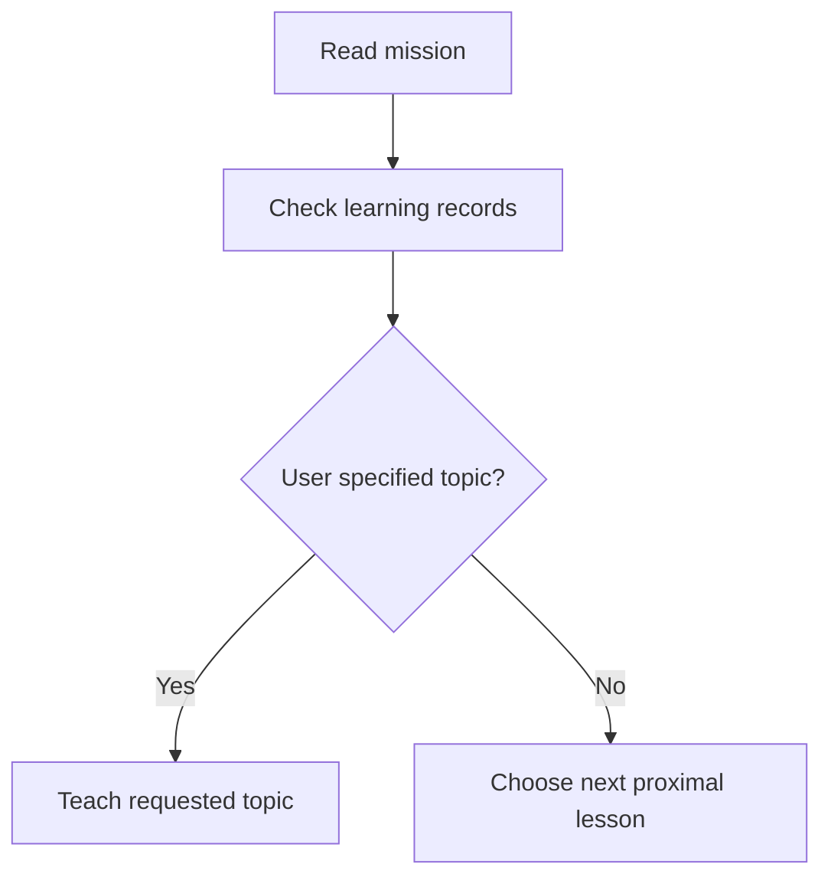
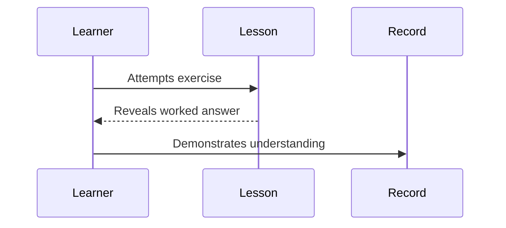
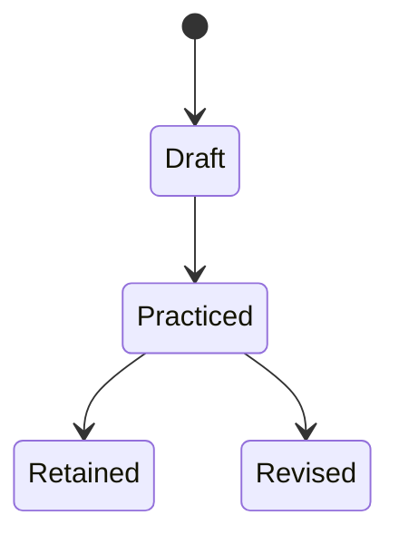
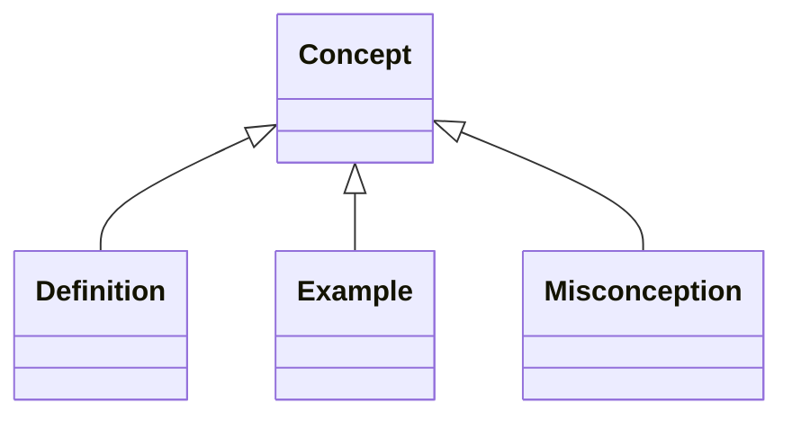

# Obsidian Markdown Style Library

Use this reference when generating or revising lessons, reference documents, glossaries, or learning records that should render well in Obsidian.

## Selection Guide

Choose the lightest format that makes the knowledge easier to retrieve later.

| Knowledge shape | Use | Good for |
|---|---|---|
| One concept | Heading + short paragraphs + example callout | Definitions, mental models |
| Many similar facts | Table | Syntax, commands, comparisons |
| Steps or branching | Mermaid flowchart | Processes, algorithms, workflows |
| Interactions over time | Mermaid sequence diagram | Protocols, conversations, API flows |
| States and transitions | Mermaid state diagram | Lifecycles, automata, product states |
| Hierarchies | Mermaid mindmap or nested headings | Taxonomies, topic maps |
| Equations | LaTeX | Math, physics, statistics |
| Common pitfalls | Warning callout | Misconceptions, edge cases |
| Practice | Question callout + details answer | Retrieval and self-checks |
| Extra context | Footnote | Citations, asides |

Do not use every format in every lesson. Prefer variety across a learning path, not visual noise inside a single short lesson.

## Lesson Frontmatter

Every lesson should start with Quartz-compatible YAML frontmatter:

```yaml
---
title: "Lesson Title"
description: "One sentence summary for search, previews, and navigation."
date: YYYY-MM-DD
tags:
  - course
  - topic-name
draft: false
---
```

Keep tags lowercase and dash-cased.

## Headings

Use ATX headings. Start each lesson with one `#` heading. Use `##` through `####` without skipping levels.

```markdown
# Lesson Title

## Section

### Sub-section

#### Detail level
```

## Callouts

Use Obsidian callouts to create scan-friendly study notes.

| Type | Use for |
|---|---|
| `note` | Important neutral context |
| `tip` | Helpful heuristic or shortcut |
| `warning` | Common pitfall |
| `danger` | Serious mistake or safety issue |
| `info` | Supplemental background |
| `example` | Concrete demonstration |
| `question` | Reflection or self-test |
| `abstract` | Summary |
| `success` | Correct outcome |
| `failure` | Incorrect outcome |

```markdown
> [!TIP] Key Insight
> The useful version of this idea is the one the learner can apply today.

> [!WARNING] Common Pitfall
> Do not mistake recognition for recall. Close the note before answering.
```

## LaTeX

Use `$...$` for inline formulas and `$$...$$` for display formulas.

```markdown
The update rule is $w := w - \alpha \nabla L(w)$.

$$
P(A \mid B) = \frac{P(B \mid A)P(A)}{P(B)}
$$
```

Use formulas only when symbolic precision helps. Otherwise explain the idea in prose first.

## Mermaid Diagrams

Prefer diagrams for structure, process, causality, and relationships.

Keep Mermaid labels conservative for Obsidian and Quartz compatibility:

- Avoid ASCII double quotes (`"`) inside node labels such as `A[你感知到的"现实"]`; some Mermaid renderers fail on this.
- Prefer Chinese quotation marks (`“现实”`), single quotes, or no quotes: `A[你感知到的现实]`.
- Use `<br/>` for intentional line breaks inside labels.
- Keep node IDs ASCII and simple (`A`, `B`, `step1`); put Chinese text only in labels.
- Avoid Markdown list syntax inside labels. `A[1. 回到事件场景]` may render as `Unsupported markdown: list` in Obsidian. Use `A[① 回到事件场景]`, `A[Step 1 回到事件场景]`, or `A[一、回到事件场景]`.

### Flowchart



### Sequence



### State Diagram



### Class or Concept Map



Supported Obsidian Mermaid types include `flowchart`, `graph TD`, `graph LR`, `sequenceDiagram`, `classDiagram`, `stateDiagram-v2`, `gantt`, `pie`, `mindmap`, and `timeline` when the local Obsidian build supports them.

## Tables

Use tables for quick comparison or lookup.

```markdown
| Concept | What it means | When to use it |
|---|---|---|
| Retrieval practice | Recall before looking | Build storage strength |
| Spacing | Revisit after delay | Reduce forgetting |
```

Keep cells short. If a cell needs paragraphs, use headings instead.

## Code Blocks

Use fenced code blocks with language tags.

````markdown
```python
def double(x: int) -> int:
    return x * 2
```
````

For shell commands, use `bash`. For config, use `yaml`, `json`, `toml`, or `ini`.

## Wikilinks

Use Obsidian wikilinks to connect lessons and references.

```markdown
See [[0002-variables-and-types]] and [[../reference/syntax-cheatsheet|Syntax Cheatsheet]].
```

Prefer links to durable reference documents over links to one-off lesson details.

## Footnotes And Citations

Use footnotes for citations and asides that would interrupt the lesson.

```markdown
Spacing improves long-term retention when reviews are distributed over time.[^1]

[^1]: Add the source title, author, and URL when available.
```

## Practice Blocks

Use `<details>` so the learner must attempt recall before reading the answer.

```markdown
> [!QUESTION] Self-check
> What is the difference between recognition and recall?

<details>
<summary>Reveal answer</summary>

Recognition means the answer feels familiar when shown. Recall means producing it from memory.
</details>
```

Avoid leaking answers through option length, formatting, or order.

Lessons are static publishable pages. Avoid chat-style endings such as "想继续吗？", "有什么问题想先问吗？", "有什么问题想先问问的吗？", "告诉我你的体验", or "有什么不明白的地方吗？". Close with something a reader can use without a conversation:

- next lesson link
- review checklist
- application assignment
- self-test
- summary of what to revisit

## Lesson Skeleton

```markdown
---
title: "Lesson Title"
description: "One sentence summary for search, previews, and navigation."
date: YYYY-MM-DD
tags: [course, topic]
draft: false
---

# Lesson Title

## Learning Objectives
- Objective 1
- Objective 2

## Core Idea
...

> [!TIP] Key Insight
> ...

## Worked Example
...

## Practice
...

## Next Step
Continue with [[next-lesson]] or complete the review task above before moving on.
```

## Quality Rules

- Make each lesson short enough to complete quickly.
- Give the learner one tangible win.
- Use at least one retrieval prompt in each lesson.
- Use diagrams when relationships or process structure matter.
- Use tables for reference material, not narrative.
- Cite primary or high-trust sources when making factual claims.
- Do not decorate. Every format should improve understanding, lookup, or recall.
